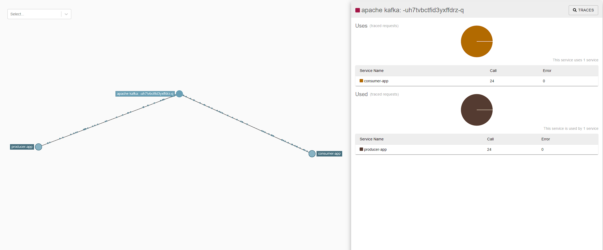

# Spring Boot 3 + Kafka + Zipkin Demo

Producer: http://localhost:8080  
Consumer: http://localhost:8085  
Zipkin: http://localhost:9411  


1. Run docker compose:
```bash
docker-compose up -d
```

2. Run the `:bootRun` tasks for both `kafka-consumer` and `kafka-producer`


3. Navigate to http://localhost:9411, you should be able to see the Zipkin dashboard.

